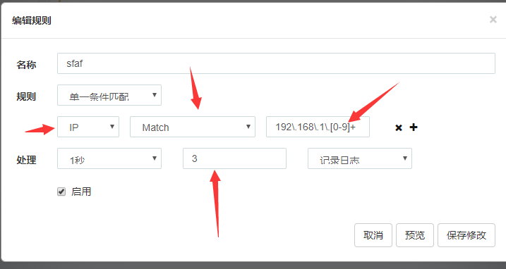

访问频率限制
===
插件名称 : Rate Limitting

---
##作用
对包含指定的值的请求进行访问频率限制,比如设置对所有ip的请求限制访问次数,包含指定header的请求一定时间内的访问次数等等.
## 使用方法
1. 添加选择器
2. 添加规则
3. 编辑规则,比如对所有"192.168.1"网段的主机限制每秒只能访问三次:

4. 如果有十台机器都属于这个网段,那么这**十台机器在一秒内总共能访问3次**
5. 如果需要对每个ip进行限制,可以使用`property_rate limitting`.

## 原理
访问频率限制是通过规则匹配次数进行限制的.如上,编写的规则是符合这个网段的主机进行限制,那么:
* 第一台主机访问,发现匹配这个规则,那么就把这个规则的ip和限制频率作为key存到计数器中.
* 第二台主机访问,发现匹配这个规则,又发现计数器中有这个规则的id的key,那么就把key的计数器加一.
...
如此一来,达到限制访问的效果.

**注意: 这个限制尽量少用,或者用在个别特殊用例上,不然容易造成全站的访问频率都被限制.**

比如设置一个规则拦截ip匹配`\S+`的请求,频率限制为1秒3次,也就是拦截所有ip,进行频率限制,这样,导致的结果是,全站每秒最多只有三个请求到来.