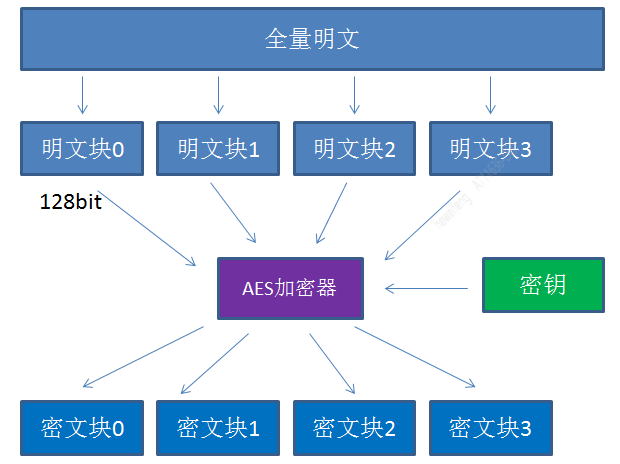

[TOC]

# 什么是AES算法

* 对称加密算法
* DES算法的替代者

# 关键要素

## 密钥key

* 加密和解密需要使用**同一个密钥**。
* 支持三种key长度: **128位，192位，256位**, 也就是key的长度分别支持16字节,24字节,32字节
* AES128，AES192，AES256,指的就是key的长度

## 填充padding

* 对明文加密的时候，并不是把整个明文一股脑加密成一整段密文，而是把明文拆分成一个个独立的明文块，每一个明文块长度128bit。
* 每个明文块的长度必须是128bit
* 如果不是128bit,支持如下填充方式:
  * NoPadding: 强制要求明文长度为16字节的整数倍
  * PKCS5Padding: 如果明文块少于16个字节（128bit），在明文块末尾补足相应数量的字符，且每个字节的值等于缺少的字符数。**如果明文块长度正好16字节,就在最后增加一个16字节的明文块**
  * ISO10126Padding: 如果明文块少于16个字节（128bit），在明文块末尾补足相应数量的字节，最后一个字符值等于缺少的字符数，其他字符填充随机数。**如果明文块长度正好16字节,就在最后增加一个16字节的明文块**

## 工作模式

ECB、CBC、CTR、CFB、OFB,不同工作模式表示不同的处理明文块的方法

CBC模式多出一个初始向量IV（Initialization Vector）。**它的作用和MD5的“加盐”有些类似，目的是防止同样的明文块始终加密成同样的密文块。**

> 使用CBC的确保加密解密统一需要确保如下值相同
>
> 1. key length（密钥位数，密码长度）
> 2.  key （密钥，密码）
> 3. IV （向量）
> 4. mode （加密模式）
> 5. padding （填充方式）

## 加密结构图

# 参考文章

[漫画：什么是AES算法？ (sohu.com)](https://www.sohu.com/a/201169795_466846)

