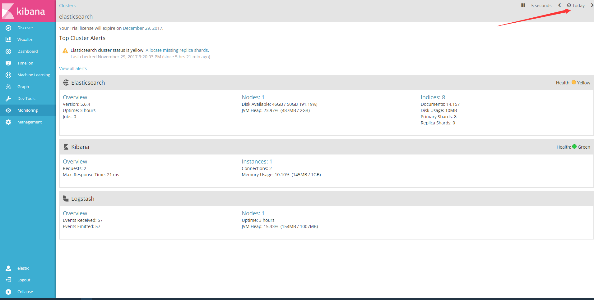

# 概述
当logstash,kibana,elastic启动后需要对内存,性能等进行监控,可以通过`x-pack`进行监控.
# 安装
`x-pack` 安装需要同时安装在`elasticsearch`,`kibana`和`logstash中.分别用于接受监控信息,显示信息,和被监控.
### 安装方法
进入到三个软件的目录下,分别运行:
``` 
./bin/softname-plugin install x-pack
```
比如`logstash-plugin install x-pack`,
> `kibana`安装会比较慢,因为它除了下载安装,还需要对web界面进行修改.耐心等待

# 配置使用
### `elasticsearch`
配置 `config/elasticsearch.yml`,用于输出监控信息到集群中的其他机器上.
``` 
xpack.monitoring.exporters:
  id1:
    type: http
    host: ["http://es-mon-1:9200", "http://es-mon2:9200"] 
    auth.username: remote_monitor 
    auth.password: changeme
```
* 没有开启安全模式可以忽略用户名和密码的配置

### `kibana`
修改配置文件,用于连接es集群:
``` 
elasticsearch.url: "http://es-mon-1:9200"
```
* 安装x-pack后,进入kibana需要登陆,默认的用户名密码为:`elastic`,`changeme`
### `logstash`
修改配置文件`config/logstash.yml`,添加项:
``` 
xpack.monitoring.elasticsearch.url: ["http://es-prod-node-1:9200", "http://es-prod-node-2:9200"] 
xpack.monitoring.elasticsearch.username: "logstash_system" 
xpack.monitoring.elasticsearch.password: "changeme"
```
* 上面的是默认用户名和密码.

# 测试
如上配置后,访问`http://IP:5601`,使用kibana的默认用户登陆,

点击`Monitoring`菜单,如果看不到数据,点击右上角的`时间选择`,选择今天.

然后如果看到了数据,表明配置成功.
