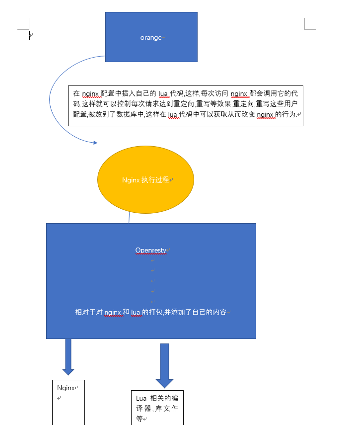

orange 安装过程
===
### 环境
1. 操作系统: linux
### 准备
1. 安装需要依赖linx系统库:  `readline-devel pcre-devel openssl-devel gcc`
1. `OpenResty`
1. lor框架
1. MySQL
### 安装
#### OpenResty安装
查看[openresty的安装](openresty安装.md)
#### 安装`lor`框架
Lor是一个运行在OpenResty上的基于Lua编写的Web框架.
* 路由采用Sinatra风格，结构清晰，易于编码和维护.
* API借鉴了Express的思路和设计，Node.js跨界开发者可以很快上手.
* 支持多种路由，路由可分组，路由匹配支持正则模式.
* 支持middleware机制，可在任意路由上挂载中间件.
* 可作为HTTP API Server，也可用于构建传统的Web应用.

> `orange`基于`lor`框架创建的监控网页
###### 安装
```$xslt
git clone https://github.com/sumory/lor
cd lor
make install
```
默认`lor`的运行时lua文件会被安装到`/usr/local/lor`下， 命令行工具`lord`被安装在`/usr/local/bin`下。
如果希望自定义安装目录， 可参考如下命令自定义路径：
```$xslt
make install LOR_HOME=/path/to/lor LORD_BIN=/path/to/lord
```
执行默认安装后, `lor`的命令行工具`lord`就被安装在了`/usr/local/bin`下, 通过`which lord`查看:
```$xslt
which lord
```
###### 测试
```$xslt
$ lord -h
lor ${version}, a Lua web framework based on OpenResty.

Usage: lord COMMAND [OPTIONS]

Commands:
 new [name]             Create a new application
 start                  Starts the server
 stop                   Stops the server
 restart                Restart the server
 version                Show version of lor
 help                   Show help tips
```
执行lord new lor_demo，则会生成一个名为lor_demo的示例项目，然后执行：
```$xslt
cd lor_demo
lord start
```
之后访问http://localhost:8888/， 即可。表示测试成功.
### mysql数据安装
创建一个数据库,供`orange`使用.默认创建数据库名称为`orange`
### 安装`orange`
orange作用于`openresty`之上,通过插入lua代码控制`nginx`的行为,然后使用web页面显示出来.
###### 获取源码
```$xslt
git clone https://github.com/sumory/orange.git
```
###### 导入数据表到mysql
进入clone下来的`orange`源码包,可以看到`install`文件夹,找到其中对应版本的`sql`文件,在`mysql`中创建一个数据库如上,然后执行`sql`文本.
###### 修改配置文件
Orange有两个配置文件，一个是`conf/orange.conf`，用于配置插件、存储方式和内部集成的默认Dashboard，另一个是`conf/nginx.conf`用于配置Nginx
```$xslt
cp conf/orange.conf.example conf/orange.conf
cp conf/nginx.conf.example conf/nginx.conf
```
orange.conf的配置如下:
```$xslt
{
    "plugins": [ //可用的插件列表，若不需要可从中删除，系统将自动加载这些插件的开放API并在7777端口暴露
        "stat",
        "monitor",
        "redirect",
        "rewrite",
        "rate_limiting",
        "property_rate_limiting",
        "basic_auth",
        "key_auth",
        "signature_auth",
        "waf",
        "divide",
        "kvstore"
    ],

    "store": "mysql",//目前仅支持mysql存储
    "store_mysql": { //MySQL配置
        "timeout": 5000,
        "connect_config": {//连接信息，请修改为需要的配置
            "host": "127.0.0.1",
            "port": 3306,
            "database": "orange",
            "user": "root",
            "password": "",
            "max_packet_size": 1048576
        },
        "pool_config": {
            "max_idle_timeout": 10000,
            "pool_size": 3
        },
        "desc": "mysql configuration"
    },

    "dashboard": {//默认的Dashboard配置.
        "auth": false, //设为true，则需用户名、密码才能登录Dashboard,默认的用户名和密码为admin/orange_admin
        "session_secret": "y0ji4pdj61aaf3f11c2e65cd2263d3e7e5", //加密cookie用的盐，自行修改即可
        "whitelist": [//不需要鉴权的uri，如登录页面，无需修改此值
            "^/auth/login$",
            "^/error/$"
        ]
    },

    "api": {//API server配置
        "auth_enable": true,//访问API时是否需要授权
        "credentials": [//HTTP Basic Auth配置，仅在开启auth_enable时有效，自行添加或修改即可
            {
                "username":"api_username",
                "password":"api_password"
            }
        ]
    }
}
```
conf/nginx.conf里是一些nginx相关配置，请自行检查并按照实际需要更改或添加配置，特别注意以下几个配置：
* lua_package_path：需要根据本地环境配置适当修改，如lor框架的安装路径, 如果lor安装的是默认的,不用改动.
* resolver：DNS解析
* 各个server或是location的权限，如是否需要通过allow/deny指定配置黑白名单ip
###### 安装
```$xslt
make install
```
###### 验证是否安装成功
```$xslt
orange help
```
成功如下:
```$xslt
Usage: orange COMMAND [OPTIONS]

The commands are:

start   Start the Orange Gateway
stop    Stop current Orange
reload  Reload the config of Orange
restart Restart Orange
store   Init/Update/Backup Orange store
version Show the version of Orange
help    Show help tips
```
通过,`orange start` 开启nginx和orange的监控平台,api端口:

* 内置的Dashboard可通过http://localhost:9999访问
* API Server默认在7777端口监听，如不需要API Server可删除nginx.conf里对应的配置

### orange运行架构和原理
如图:
